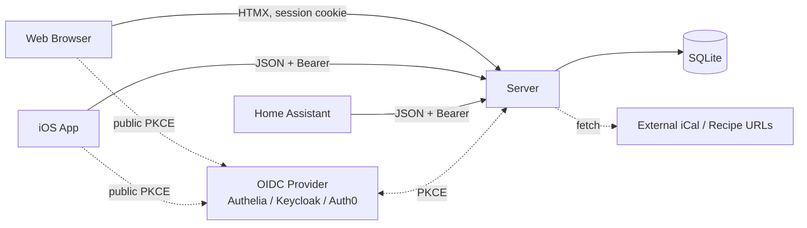
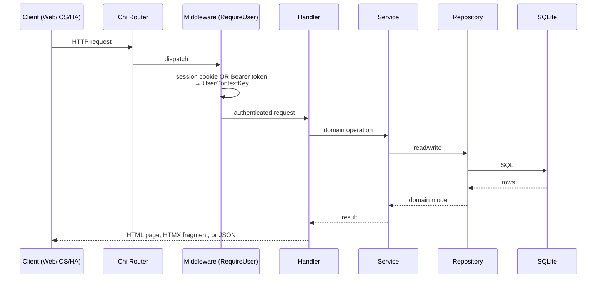
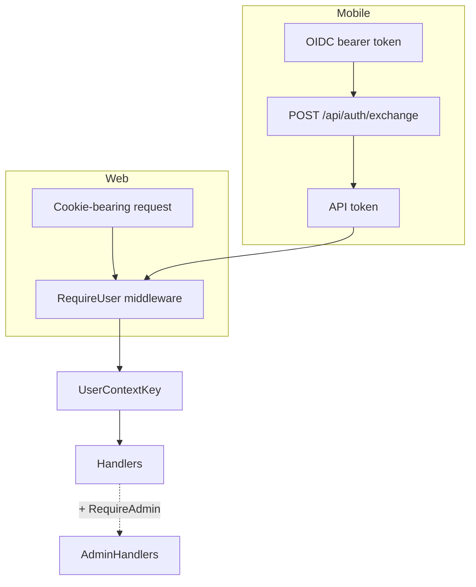
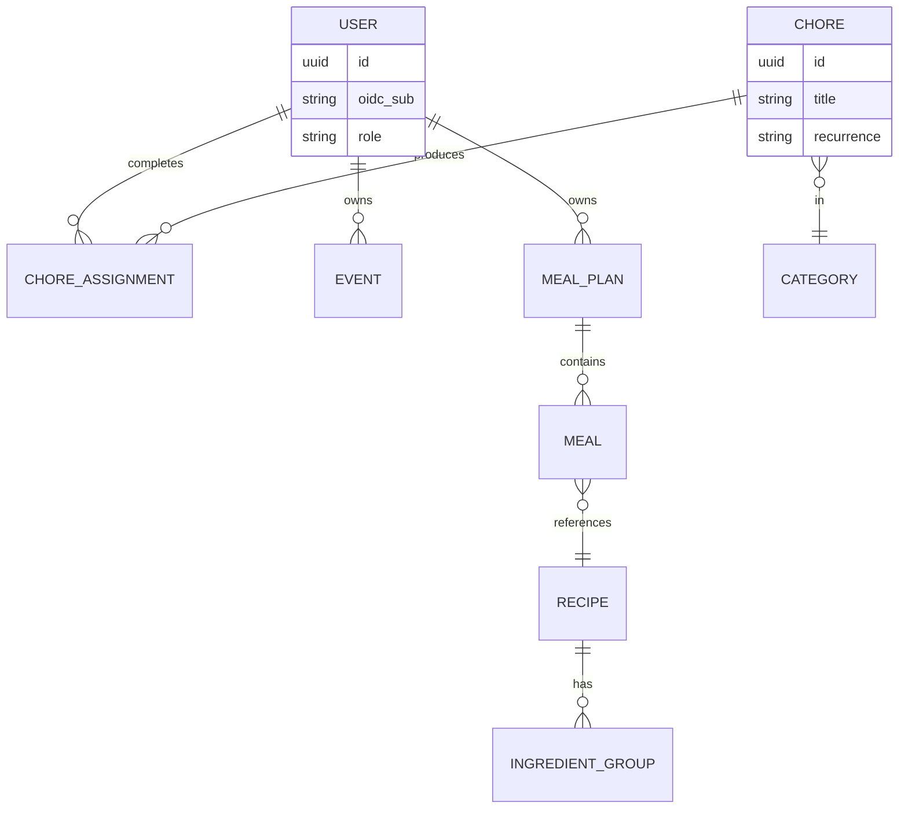

# Architecture

> System design, components, and request flow for Family Hub.

## Overview

A single Go binary serves both a server-rendered web UI (Templ + HTMX +
Tailwind) and a JSON REST API consumed by a SwiftUI iOS app and a Home
Assistant HACS integration. All three clients share the same OIDC auth flow
via a public PKCE client. SQLite is the system of record; the iOS app caches
in SwiftData but has no offline write path.

## Diagram

## Components

| Component | Responsibility | Location |
|-----------|---------------|----------|
| HTTP server | Chi router, middleware, handlers | `server/internal/server/`, `server/internal/handlers/` |
| Services | Business logic (recurrence, chore assignment, iCal fetch, recipe extraction, SSRF guard) | `server/internal/services/` |
| Repositories | Data access (one per feature area, interface + SQLite impl) | `server/internal/repository/` |
| Templates | Templ pages, layouts, components (compiled to Go) | `server/templates/` |
| Migrations | Auto-run on startup | `server/internal/database/migrations/` |
| iOS app | SwiftUI client (SwiftData cache, no offline writes) | `ios/` |
| HA integration | Custom HACS component | `home-assistant/` |

## Request Flow

Handlers return either a full page or an HTML fragment depending on the
`HX-Request` header — same handler, different render.

## Auth Flow

A single public OIDC client is shared across web and iOS. Two post-login
mechanisms converge on the same context key:

Public routes (no auth): `/health`, `/static/*`, `/api/client-config`,
`/login`, `/auth/callback`, `/logout`. Mobile obtains an API token via
`POST /api/auth/exchange` (one-time OIDC bearer). There is no onboarding
flow and no iCal feed export.

## SSRF Guard

Any handler that fetches an external URL on a user's behalf (iCal
subscriptions, recipe URL import) routes through
`services.ValidateExternalURL` / `services.NewSafeHTTPClient` in
`services/safenet.go`. This blocks private IP ranges and non-HTTP(S) schemes.

## Data Model

See `server/internal/models/` for the full domain. Headline shape:

## External Dependencies

| Service | Purpose | Failure mode |
|---------|---------|--------------|
| OIDC provider | Auth for all clients | Login blocked; existing sessions/tokens unaffected |
| External iCal feeds | Calendar subscriptions | Subscription marked stale; existing events remain |
| Recipe URLs | Recipe import (JSON-LD + HTML fallback) | Import returns an error to the user |

## Key Decisions

- **One binary, three clients.** Web, iOS, and HA all hit the same REST surface — no separate "mobile API" — so feature work doesn't fan out.
- **Public PKCE OIDC client for everything.** No client secrets to manage; same client ID for web and iOS, distinguished only by redirect URI.
- **Pure-Go SQLite.** `modernc.org/sqlite` removes the CGO toolchain dependency for builds and tests; `:memory:` in tests.
- **No offline writes on iOS.** SwiftData is a cache; mutations require connectivity. Removes a class of sync bugs at the cost of usability when offline.
- **Repository → Service → Handler.** Handlers never reach a repository directly; this makes business logic testable with fakes.
- **Migrations run on startup.** No separate migration step in deployment; SQLite is a file so it's safe to gate behind a server bootstrap.
